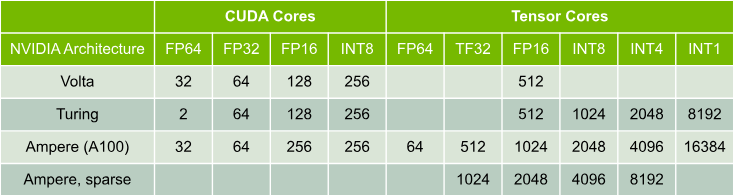

**FLOP (Floating Point operation):** Refers to a single arithmetic operation that involves floating-point numbers such as addition, subtraction, multiplication and division. Each of these counts as _one FLOP_ assuming they involve floating-point data types like `float32` or `float16`. 

In the context of deep-learning in a matrix multiply like `C = A \times B`, every dot product of row `A` and column of `B` involves many _multiply-adds_. Each individual multiply-add (e.g. `a * b + c`) is typically counted as 2 FLOPs i.e. one multiply and one addition. FLOPs is generally a good performance metric - how many FLOPs our GPU or CPU can do per second. An NVIDIA A100 has a peak performance of 312 trillion FLOPs per second (e.g. 312 teraFLOPs). 

We can calculate _theoretical FLOPs_ for AI models, but actual GPU usage depends on sparsity, quantization and tensor core utilization. We use **framework profilers** e.g. `torch.profiler`, `nvprof`, and `nsight` to give us _actual FLOP utilization_ as opposed to theoretical utilization. Padding, stride, dilation and groups can affect the shape but not the core FLOPs formula (though grouped/depthwise convolutions reduce FLOPs).

# [NVIDIA GPU Architecture](https://docs.nvidia.com/deeplearning/performance/dl-performance-gpu-background/index.html)

It is helpful to understand the basics of GPU execution when reasoning about how efficiently particular layers or neural networks are utilizing a given GPU. First we will dive into the basic structure of GPU architecture. Ultimately, the GPU is a _highly parallel processor_ that is composed of processing elements and a memory hierarchy. At a high-level there are multiple **Streaming Multiprocessors (SMs)**, an on-chip L2 cache, and high-bandwidth DRAM. Arithmetic and other instructions are executed by the SMs; data and code are accessed from DRAM through the L2 cache. 

Let's take the statistics of an A100 GPU for example, this contains 108 SMs, a 40MB L2 cache, and up to 2039 GB/s bandwidth from 80GB of HBM2 memory. Each SM has its own instruction schedulers and various instruction execution pipelines. _Multiply-add_ is the most frequent operation in modern neural networks, which acts as a building block for fully-connected and convolutional layers, both of which can be viewed as a collection of vector dot-products. **Note that this is different in the transformer-driven language model era**. 

FP16 operations can be executed in either Tensor Cores or NVIDIA CUDA cores. In certain architectures, we can execute INT8 operations in either Tensor Cores or CUDA cores. Tensor Cores were introduced in Volta to accelerate matrix multiply and accumulate ops for machine learning. These instructions operate on small matrix blocks. Note that Tensor Cores _can compute and accumulate in higher precision than the inputs_. For example, during training with FP16 inputs, Tensor Cores can compute products without loss of precision and accumulate in FP32. _When math operations cannot be formulated in terms of matrix blocks, they are executed in CUDA cores[^1][^2]._ 

To utilize their parallel resources, GPUs execute many threads concurrently; GPUs execute functions using a 2-level hierarchy of threads - a given function's threads are grouped into equally-sized _thread blocks_, and a set of thread blocks are launched to execute the function. GPUs hide dependent instruction latency by switching to the execution of other threads. Thus the number of threads needed to effectively utilize a GPU is much higher than the number of cores or instruction pipelines. 

**2-level thread hierarchy:**

[^1]: Tensor Cores are specialized matrix-multiply-accumulate (MMA) units introduced in NVIDIA Volta and improved in Ampere and Hopper. They are designed for _dense, structured_ operations on _small matrices_ (e.g. 4x4, 8x8, 16x16 tiles). They are incredibly efficient at batched matrix multiplication e.g. GEMM, CNNs, transformers, and operate through fused operations that minimize instruction overhead. To use them, our operation must match the MMA interface `D = A \times B + C` where $$A,B,C,D$$ are dense matrices. However **many deep learning/numerical ops don't naturally fit this including ReLU/sigmoid/tanh (element-wise ops)**, broadcasting ops (scalar add, batch norm), control flow/irregular indexing (gather,scatter,masked selection) and sparse/unstructured ops(dynamic shapes and pointer-based memory access). These **cannot be turned into MMA ops** so tensor cores have no advantage and _often cannot be used_, so we must route to CUDA cores (general-purpsoe floating-point/vector ALUs), optimized for warp-synchronous SIMD-style execution, capable of issuing scalar/elementwise instructions per-thread. 
[^2]: Frameworks like cuDNN, cuBLAS, and TVM try to transform operations to match MMA blocks if possible (i.e. through tiling, fusion or lowering to matmul) but when this isn't feasible they let CUDA cores handle the workload. 

