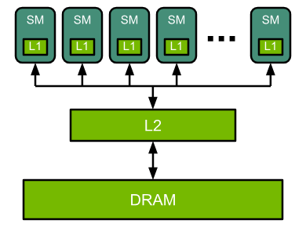

**FLOP (Floating Point operation):** Refers to a single arithmetic operation that involves floating-point numbers such as addition, subtraction, multiplication and division. Each of these counts as _one FLOP_ assuming they involve floating-point data types like `float32` or `float16`. 

In the context of deep-learning in a matrix multiply like `C = A \times B`, every dot product of row `A` and column of `B` involves many _multiply-adds_. Each individual multiply-add (e.g. `a * b + c`) is typically counted as 2 FLOPs i.e. one multiply and one addition. FLOPs is generally a good performance metric - how many FLOPs our GPU or CPU can do per second. An NVIDIA A100 has a peak performance of 312 trillion FLOPs per second (e.g. 312 teraFLOPs). 

We can calculate _theoretical FLOPs_ for AI models, but actual GPU usage depends on sparsity, quantization and tensor core utilization. We use **framework profilers** e.g. `torch.profiler`, `nvprof`, and `nsight` to give us _actual FLOP utilization_ as opposed to theoretical utilization. Padding, stride, dilation and groups can affect the shape but not the core FLOPs formula (though grouped/depthwise convolutions reduce FLOPs).

# [NVIDIA GPU Architecture](https://docs.nvidia.com/deeplearning/performance/dl-performance-gpu-background/index.html)

It is helpful to understand the basics of GPU execution when reasoning about how efficiently particular layers or neural networks are utilizing a given GPU. First we will dive into the basic structure of GPU architecture. Ultimately, the GPU is a _highly parallel processor_ that is composed of processing elements and a memory hierarchy. At a high-level there are multiple **Streaming Multiprocessors (SMs)**, an on-chip L2 cache, and high-bandwidth DRAM. Arithmetic and other instructions are executed by the SMs; data and code are accessed from DRAM through the L2 cache. 

Let's take the statistics of an A100 GPU for example, this contains 108 SMs, a 40MB L2 cache, and up to 2039 GB/s bandwidth from 80GB of HBM2 memory. Each SM has its own instruction schedulers and various instruction execution pipelines. _Multiply-add_ is the most frequent operation in modern neural networks, which acts as a building block for fully-connected and convolutional layers, both of which can be viewed as a collection of vector dot-products. **Note that this is different in the transformer-driven language model era**. 