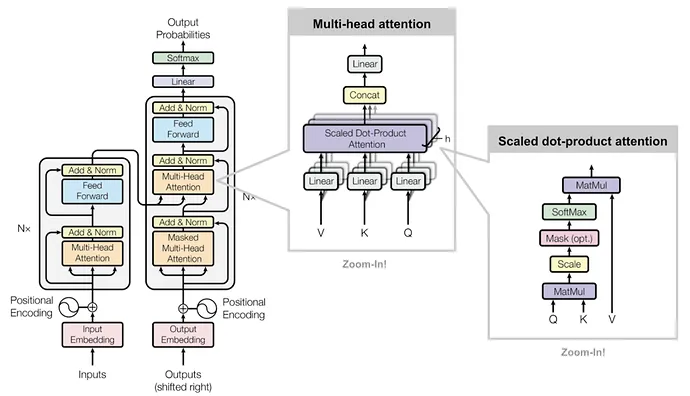

# KV Caching

One of the most important bottlenecks in modern LLM inference is **[Key-Value (KV) caching](https://github.com/TreeAI-Lab/Awesome-KV-Cache-Management)**. In Transformer models, every token's output attends to all previous tokens through the **self-attention mechanism**. This means that for each new token during inference, the model would need to recompute attention over _all previous tokens_, which is extremely inefficient. 



So when a model is generating text, it looks at all the previous tokens to predict the next one, and normally it would _repeat the same calculations_ for every new token, which can slow things down. 

KV caching avoids this recomputation. Instead of recomputing key and value matrices from scratch for each past token, we **compute them once and store/cache them**. Then, when generating the next token, the model can just:

- Compute the _query_ for the new token.
- Reuse the cached keys/values from the past tokens.
- Compute attention using the new query and the cached key-value store.

This reduces computation from quadratic to linear in sequence length. 

> KV caching solves compute overlap by _remembering these calculations_ from previous steps, which can be achieved by storing the intermediate states of attention layers during inference

```
# Pseudocode for KV Caching in PyTorch
class KVCache:
    def __init__(self):
        self.cache = {"key": None, "value": None}

    def update(self, key, value):
        if self.cache["key"] is None:
            self.cache["key"] = key
            self.cache["value"] = value
        else:
            self.cache["key"] = torch.cat([self.cache["key"], key], dim=1)
            self.cache["value"] = torch.cat([self.cache["value"], value], dim=1)

    def get_cache(self):
        return self.cache

```