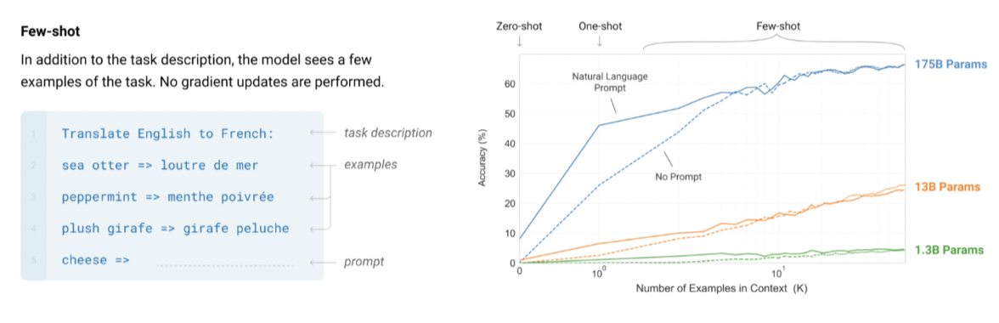

# In Context Learning

Even though LLMs are only trained to predict the next token, that task ends up _implicitly training them on many NLP tasks_, so we can actually consider next-word prediction as multi-task learning at scale. 

| Prompt                                                       | Implied Task         |
| ------------------------------------------------------------ | --------------------- |
| “I enjoy swimming, biking, and {running, toaster}”           | Grammar / Syntax      |
| “The ingredients are flour, eggs, and {sugar, bicycle}”       | Semantic Consistency  |
| “The currency of Japan is the {yen, dollar}”                 | Factual Knowledge     |
| “The food was delicious, and the service was {excellent, rude}” | Sentiment Analysis |
| “The French word for ‘hello’ is {bonjour, adiós}”            | Translation           |
| “12 × (4 + 3) = {84, 96}”                                    | Basic Arithmetic      |
| “She picked up the violin and began to {play, drive}”        | Common Sense Inference |
| “Photosynthesis occurs in the {chloroplast, pancreas}”       | Science Knowledge     |

Because the internet contains _examples of nearly every human cognitive task expressed in language_, training on next-word prediction _forces_ [the model to learn these tasks to minimize loss](https://www.jasonwei.net/blog/some-intuitions-about-large-language-models). So next-word prediction on a massive corpus becomes equivalent to solving thousands of diverse NLP tasks, with no labels required. 

> Learning input-output relationships can be cast as next-word prediction. This is known as in-context learning.

Whilst machine learning initially focused on learning relationships between <input, output> pairs, the big breakthrough arose when we rephrased this problem as next-word prediction, since it is so easy to recast the problem in this view. However, we can "trick" these new generation of next-token language models to act like a traditional IO ML model just by formatting our prompt as examples of input-output pairs - this is called **incontext learning**. 

```
# Traditional machine learning training set
(input: "2+2", output:"4")
(input: "Translate 'hello' to French", output: "bonjour")
# We then train the model with gradient descent to learn a function from input to output. Once trained, the model gives answers on new inputs. 
```

Language models are typically only trained to predict the next token, but when we prompt them in an IO fashion:

```
Q: What is the capital of France?
A: Paris
Q: What is 5 + 3?
A: 8
Q: What is the opposite of 'cold'?
A:
```
the LLM learns from the pattern in context, and predicts "hot" as the next token _as if it learned from the input-output examples provided_. The process of pattern-matching and generalizing from a few in-context examples is called **in-context learning**. The model is doing just one thing i.e. predicting the next word, but when provided with a sequence of examples as an input, it learns a mapping within that context (even though the model's weights don't change at all). We can prompt it with 0, 1, or many examples (zero-shot, one-shot, few-shot) and teach it new tasks on the fly, using only the prompt without retraining/fine-tuning. 



TLDR, the following prompt:

```
English: dog → German:
```

would give a weaker answer, or a lower-confidence answer (due to the lack of in-context examples), than the prompt:

```
Translate English to German:
English: apple → German: Apfel
English: house → German: Haus
English: dog → German:
```

as this would set the task explicitly, provide several IO examples, and gives the model a pattern to follow, thereby enabling **in-context learning** (without updating underlying weights). 

In-Context Learning (ICL) is the ability of large language models (LLMs) to learn new tasks at inference time by conditioning on examples provided in the input prompt, without updating any model weights. It allows LLMs to generalize to unseen tasks and domains purely through pattern recognition and attention over tokens. ICL is foundational to how models like GPT-3/4, ChatGPT, Claude, and LLaMA operate. It underpins behaviors such as few-shot learning, zero-shot generalization, instruction-following, and even tool-use — all via prompt design.


> Real in-context learning happens, but only in large-enough language models

> Some tokens require more "thinking" to let the model reason. **Not all tokens are equal**. 

"A researcher working at Google Deepmind is working on artificial ___", predicting "intelligence" is easy.

"The power of the Qi nation lies in ___", this is very uncertain, and difficult for the model to guess.

"What is [INSERT COMPLEX EQUATION HERE]" -> this requires extremely complex reasoning. 

To handle the latter two "hard" tokens, we use **Chain-of-Thought prompting** to encourage the model to reason step-by-step before giving the final answer. It mimics how humans do multi-step tasks. This leads to more advanced prompting methods like _least-to-most prompting_ and _ReAct prompting_ (combining reasoning and actions). Reasoning means that we are spending more computation/time on hard tokens, and prompting helps allocate that time. 