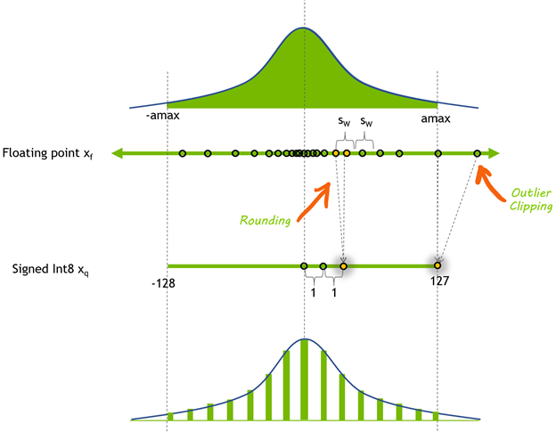

# Quantization

Most production-grade ML models are trained in FP32 arithmetic to take advantage of the wider dynamic range, however at inference, these models may take a longer time to predict results compared to those at reduced precision inference, causing some delay in real-time responses and thereby affecting user experience. Hence we "quantize" or reduce precision at inference time to 8-bit integer numbers (typically). Rounding the weights after training may result in a lower accuracy model, especially if the weights have a wide dynamic range. 



Quantization refers to converting higher-precision data types into lower-precision formats. _Lower-precision types mean fewer bytes per element_. Reducing bytes per element will increase **arithmetic intensity[^1]**. This can turn memory-bound ops into math-bound, if our math bandwidth can keep up[^2]. Indeed, when we quantize to 8-bit integer data, NVIDIA GPUs employ faster and cheaper 8-bit tensor cores to compute convolution and matrix-multiplicaiton operations, yielding more compute throughput, which is particularly effective on compute-limited layers. A reduced memory footprint means that the model requires less storage space, parameter updates are smaller and cache utilization is higher. 

Note that floating point numbers are distributed nonuniformly in the _dynamic range_ of their defined interval, and about half of the representable floating-point numbers are in the interval [-1, 1] i.e. representable numbers in this interval would have higher precision than those in the interval [1, 2]. This high density of representable 32-bit floating point numbers in this interval is helpful in ML models where parameters and data have most of their distribution mass around zero. However when we use an 8-bit integer representation, we can only represent $$256$$ different values, and they are typically distributed uniformly around zero because this makes it easier to enable computing using high-throughput parallel pipelines. 

## Floating Point Representations

Floating-point numbers represent real numbers using $$(-1)^s \cdot 2^e \cdot (1 + m)$$, where $$s$$ is the sign bit ($$0$$ for positive, $$1$$ for negative), $$e$$ is the exponent (bias encoded), and $$m$$ is the mantissa (also called significand/fraction). This format allows wide _dynamic range_ with constant relative position. 

```math
x = (-1)^s \cdot 2^{e - \textbf{bias}} \cdot (1 + m)
```

where $$s$$ is the sign bit ($$0$$ for $$+$$, $$1$$ for $$-$$). $$e$$ is the exponent, which is encoded/biased, $$m$$ mantissa [^3]. The reason we have a bias term is so that we can store positive bits and have decimal numbers using only an unsigned integer as the exponent field. 

> A bias term enables us to store both positive and negative exponents using just bits for unsigned integers.

### Mantissa 

Let's see what range of values $$m$$, our mantissa can take depending on how many _mantissa bits_ there are. Let us first hone in on FP64, and walk through some hypothetical combinations of sign, exponent and mantissa. Note that in the canonical FP64 representation, the mantissa (fractional part) is 52-bits wide. Each bit $$b_i$$ contributes to the final mantissa value as follows:
```math
m = b_1 \cdot 2^{-1} + b_2 \cdot 2^{-2} + \cdots + b_{52} \cdot 2^{-52} \in [0.0, 1.0)
\Rightarrow 1 + m \in [1.0, 2.0)
```
note that it only covers the interval $$[1.0, 2.0)$$ with a precision bounded by $$2^{-m}$$, and therefore decimal values/floating point values are approximated by what the binary represents. 

_Why 52 Mantissa Bits in FP64?_

This was a decision based on precision-engineering rooted in backward compatibility, hardware efficiency, and binary-decimal precision. The IEEE-754 double precision (FP64) must fit into 64 bits for memory alignment (8-byte word), hardware register size (e.g. x864-64), SIMD vector operations, cache line efficiency. So we have $$64$$ bits to divide up to:

- $$1$$ bit for the sign
- $$E$$ bits for the exponent
- $$M$$ bits for the mantissa

```math
1\textbf{(sign)} + E + M = 64 
```

> For a fixed number of floating point bits B, the higher the number of mantissa bits, the more precise numbers we can represent; but this leads to less space for the exponent bits, and therefore, the smaller range of real numbers we can represent.

$$52$$ mantissa bits can represent up to $$\log_{10}(2^{53} \simeq 15.95$$ decimal digits, which is a sweet spot in scientific computing. 

$$$$

## Post-Training Quantization of LLMs

https://developer.nvidia.com/blog/post-training-quantization-of-llms-with-nvidia-nemo-and-nvidia-tensorrt-model-optimizer/

https://docs.nvidia.com/nemo-framework/user-guide/latest/model-optimization/quantization/quantization.html

## Quantization-aware Training

https://developer.nvidia.com/blog/achieving-fp32-accuracy-for-int8-inference-using-quantization-aware-training-with-tensorrt/

## QLoRA

Introduced by Dettmers et al. in 2023, QLoRA enables efficient fine-tuning of large language models using 4-bit quantization, low rank adapters and double quantization. It makes it possible to fine-tune a 65B model on a single 48GB A100 GPU, without losing performance compared to full-precision tuning. 

## NVFP4

NVFP4 is an excellent anchor for mastering modern quantization, to go deep, we'll build from first principles. 

[^1]: Recall that [arithmetic intensity](https://github.com/brucechanglongxu/advancedalgorithms/blob/main/numerics/arithmeticintensity.md) is defined as FLOPs/bytes. Intuitively, it answers the question _for every byte that is loaded from memory, how much math is done before I need another one?_. It is a property at the algorithm/kernel level and not a function of the hardware (e.g. a single SM block). It doesn't matter how many SMs are used during the computation, the ratio is computed globally for the entire kernel launch. 
[^2]: ReLU is traditionally a memory bound operation in FP16, but it could become _less so_ in INT8 not because it does more math, but because it is moving fewer bytes. 
[^3]: The mantissa lies in the interval $$[0, 1)$$; all IEEE754 normalized floating point formats assume a leading $$1$$ (a.k.a. _hidden bit_). So the mantissa encodes the **fractional part**. The actual significant is $$1 + m \in [1, 2)$$. 
