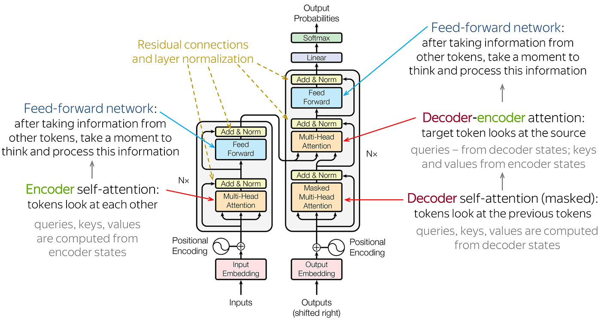

# Deep Dive into Transformers
The transformer architecture is a neural network design that processes sequences in parallel using _self-attention_ instead of recurrent/convolutional layers. It was introduced in the seminal _"Attention Is All You Need"_ (Vaswani et al. 2017) paper originally for machine translation. The key components of a Transformer layer are:
1. **Multi-Head Self-Attention:** to relate tokens to each other.
2. **Position-Wise Feed-Forward Network:** to tranform each token's representation.
3. **Residual Connections and Layer Normalization:** to enable stable deep learning.
4. **Positional Encoding:** to inject sequence order information.
5. **Softmax Output Layer (Final):** for producing probabilities. 

Let's dive into the central question of _what actually gets learned in a transformer during pretraining?_ Weights fall into several categories, the first is the token embedding matrix $$E$$ which has shape $$V \times d$$ (where $$V$$ is the vocabulary size, and $$d$$ is the embedding dimension). This maps each discrete token into a continuous embedding (vector) space [^5] (think of it like a semantic lookup table, the word "dog" would have its own row in $$E$$). We can decrease the size of this matrix by using [byte-level/character-level](https://github.com/brucechanglongxu/advancedalgorithms/blob/main/transformer/tokenization.md) tokenization instead of a rigid tokenization scheme like BPE. 

Now for each of the $$L$$ Transformer layers, we have A. Multi-Head Self-Attention (MHSA) and B. Feedforward Networks (FFN). In the MHSA blocks, each head has its own set of projection matrices $$W_Q, W_K, W_V$$ with shape $$d \times d_h$$ (where $$d_h = d / h$$ is the number of heads) which projects the input embeddings to Queries, Keys, and Values [^4], and have an output projection matrix $$W_O$$ with shape $$d \times d$$. 

## Encoder-Decoder Architectures

Encoders are neural network components that transform input data into a compact representation or "encoding." They capture essential features of the input, reducing dimensionality while preserving important information. In natural language processing, encoders often process sequences of words or tokens. 

One of the key differences between encoder-decoder and decoder-only architectures is that the former allows for _bidirectional attention_ [^3] (in the encoder), but decoder-only models are restricted to causal (left-to-right) attention.

### Encoder-only Architectures

These Transformer blocks read the entire input sequence and transform it into an output sequence of the same length (or into some pooled representation). The input (e.g. a sentence) is typically prepended with a special token like `[CLS]` for classification tasks and segmented with `[SEP]` if needed. All tokens are passed through $$N$$ encoder layers. Each encoder layer has self-atention that is _bidirectional_ (no mask, so each token attends to all others, left and right). Therefore, the output representations are rich with context from both past and future tokens relative to each position. At the top, we either take the sequence of contextual embeddings for each token (for tasks like token-level prediction e.g. Named Entity Recognition [^0]).

Because self-attention is bidirectional, the encoder is suited for **non-generative** tasks, where understanding the full sequence holistically is needed. BERT for example captures relationships in a sentence in a deeply bidirectional way (unlike an autoregressive model, which can't see future tokens). This yields very strong representations for tasks like text classification, visual question answering (extractive), and token tagging. However, an encoder-only model has no mechanism to generate a sequence beyond its input length due to its non-causal structure and autoregressive process. **BERT is not naturally a text generator**, if one needs to generate text using an encoder-only model, one would have to plug it into some generative framework (e.g. use BERT as an encoder and have a separate decoder, or iteratively mask and fill like in BERT's pretraining, but those are less straightforward). 

In summary, encoder-only (like BERT) _produces representations_. It modifies data flow in that entire input is processed in parallel, and output emerges simultaneously for all positions (there's no notion of sequential decoding). The advantage is efficiency and full-context comprehension; the trade-off is that we can't directly do sequence generation. For tasks that require outputting a label or extracting spans, this is fine. Indeed, BERT has achieved state-of-the-art on many language understanding benchmarks by leveraging this architecture to fully analyze input text. 

**Examples:**
- **BERT (2018):** 12-layer or 24-layer encoder network. Trained on masked language modeling (15 percent tokens randomly masked and predicted) and next-sentence prediction. At fine-tune time, used for classification (using [CLS]) or QA (using start/end token position outputs via softmax) etc. BERT's architecture (being encoder-only) means it is bidirectional, which is largely credited for its success. 
- **RoBERTa, ALBERT, DistilBERT:** are all encoder-only, often focusing on similar usage. 
- **CLIP text encoder (2021):** the text part of CLIP is an encoder transformer that produces an embedding for the whole sentence (which is then matched with an image encoder's output in vector space). It doesn't generate text, just provides a representation.
- **Vision Transformers (ViT) as encoders:** ViT is essentially an encoder that produces a representation of an image (with a special class token for classification). It's not generating images, just encoding. 

### Decoder-Only Tranformers

A decoder-only Transformer generates sequences autoregressively. _Data flow:_ at training time, we typically feed in the entire sequence of tokens with an appropriate mask so that each position can only attend to earlier positions. So the position $$t$$ in the training sequence is trying to predict token $$t$$ given tokens $$<t$$. The decoder has the same stack of $$N$$ layers, but each layer's self-attenion is **masked** such that no information flows from future tokens. At inference, generation starts with a prompt (which could be empty or some context like a prompt in ChatGPT) and then the model produces the next token probability via softmax, samples one, appends it to the input, and repeats. There's no separate encoder providing additional information (unless we treat the prompt as an "encoder input", but it's actually handled in the same self-attention mechanism). 

> Crucially, decoder-only models often **do not have explicit cross-attention sublayer** (since there's no separate encoder). 

A decoder-only model is naturally suited for _sequence generation_ (language modeling, code generation etc.). It generates text in a left-to-right fashion, which aligns with how we typically produce language. This makes it directly usable for tasks like writing a continuation of a prompt, dialogue response, translating by prefixing with source text and letting it generate target (with careful prompting). However, it has limitations for tasks that need considering an entire input sequence (like classification or extractive QA): since it's unidirectional, if we feed a question into a decoder-only model and ask it to generate an answer, the model doesn't automatically get to attend to the question's words after it starts generating, except via. the left context with includes the question.

In practice, this means that we put the question in the prompt and then the model generates the answer after it, treating the whole prompt/answer as one sentence. The model will attend to the question tokens when generating the answer because they are to the left (earlier in the sequence). So decoder-only models _can_ handle tasks like Q&A or summarization by concatenating input and letting it generate output, but they treat it as a long text to model, rather than having a clean separration. This leads to a difference in _data flow_: in a decoder-only approach to Q&A, the model sees (Question + special token + Answer) as a single sequence during training and learns to output Answer after Question. There's no explicit guarantee it used all info from the question, but if trained well, it will learn to. In an encoder-decoder, the question is processed fully in encoder, and the decoder _must_ attend to those encoder states for information because otherwise it has no input. In other words, encoder-decoder forces a separation of input and output; decoder-only merges them into one sequence context. 

**Benefits:**
- Simpler architecture (just one stack), all model capacity can be focused into one big transformer network. GPT-3's choice of a single 96-layer decoder was partly due to that simplicitly, it is easier to scale up and implement.
- Training data for decoder-only is easy: just take a large text corpus and do next-word prediction (which is what GPT models do). For encoder-decoder, you often need paired data if you want to perform a specific mapping (like translation requires source-target pairs). There are unsupervised seq2seq pretraining schemes (like [T5's span denoising](https://arxiv.org/pdf/2205.05131)), but those are more complex than plain language modeling. 
- A decoder-only LM is quite versatiile; it can be prompted to do many tasks (few-shot learning as shown by GPT-3) by just giving it instructions or examples in the prompt, because it will just continue the sequence in a way that hopefully follows the pattern. 

**Trade-off**
- It lacks the direct bidirectional understanding: at any generated token, it only has left context. However, at training time it did have full context for tokens in the middle of sequences because of teacher forcing (but they still couldn't attend to the right context in computing attention).
- It is inherently sequential in output production (one token at a time), which is fine, but it can't revise previous outputs. Encoder-decoder could in theory do some tricks like output sequence might refer back.
- For tasks like classification, you have to coax a decoder-only model to output a label. GPT does this through a prompt like _"Review:... Sentiment"_ and then it outputs _"Positive"_ or _"Negative"_. The model has to effectively do classification by generation. This works quite well actually, but it's a bit indirect. With an encoder, we would just put a classifier on [CLS]. 

**GPT series (GPT-1, 2, 3, 4)** are all decoder-only transformers, and they are trained to predict the next token given all previous ones, using masked self-attention. They have been astonishingly successful at language generation, and via prompting, a variety of tasks. 

**ChatGPT and instruct models:** These are decoder-only models fine-tuned with instruction-response pairs and RLHF. Under the hood, they are still generating the answer as a continuation of the conversation history. GPT-Neo, GPT-J, LLaMA are decoder-only models that follow the GPT architecture with minor modifications like rotary embeddings. 

### Encoder-Decoder Transformers

Encoder-decoder architectures use two stacks: an encoder to _encode a source sequence_ (into a fixed-length) (a fixed number of hidden states) representation, and a decoder to _generate a target sequence_ from that representation. 

1. The encoder takes source tokens (e.g. an input sequence) with 

## (Multi-Head) Self-Attention

$$A(Q, K, V) = s(\frac{QK^T}{\sqrt{d_k}}) \cdot V$$

In tasks like language modeling or image understanding, context matters. The meaning of a word depends on other words around it; in images, the interpretation of a pixel depends on its surroundings. We will first focus on autoregressive[^1], decoder[^2] models which are trained on a task of _predicting the next token in a sequence_. During inference, the model is provided with some text, and its task is to predict how this text should continue. 

Mathematically, the goal of self-attention is to transform each input (embedded token from pretraining) into a _context vector_ which combines the information from all the inputs (embedded tokens) of your chat history so far. The word "dog" will have an initial embedding representation after pre-training (this will differ from model to model e.g. GPT-4 will have one embedding representation whereas LLaMA will have another, and starting with a clean chat we begin with this embedding), and as we go along and use the word "dog" in various contexts in our chat, we will update the ongoing representations of "dog" based on the increasing context that is provided to us.  

### Grouped-query Attention
### Paged Attention
### Sliding window Attention

## Position-Wise Feed-Forward Networks (FFN)

## Residual Connections (Skip Connections)

## Layer Normalization

## Positional Encoding

## Softmax Output Layer

[^0]: Classify each token into classes. 
[^1]:
[^2]: 
[^3]: Each token can attend to all other tokens in the same sequence, including tokens **before and after itself**. It is a full reader that can look ahead and behind the current token. This highlights why encoder-decoder models would be highly inefficient for chatbots, because every time we have a new line in our conversation, _we would need to encode the entire transcript again_ (to look "bidirectionally") before subsequently decoding to do next token generation. 

[^5]: Technically, we can remove or randomize E at the start rather than have it as a learnable parameter, however the other parts of the transformer network will subsequently need to learn to compensate - can the rest of the transformer absorb what is usually learned in embeddings? Most likely, given enough depth and data. Ablation studies in early BERT/GPT work show that freezing E often degrades performance. E encodes prior knowledge about token similarity (e.g. "cat" is similar to "dog" - semantic compression) and avoids forcing deeper layers to relearn lexical properties from scratch. **Token-free** transformers use characters/bytes (the must fundamental building blocks) as inputs so the vocabular is tiny, and the embedding matrix is very small, and learn representations of words/characters from scratch. 

Encoder-Decoder: https://github.com/xbeat/Machine-Learning/blob/main/Understanding%20Encoders%2C%20Decoders%2C%20and%20Encoder-Decoder%20LLMs.md

https://arxiv.org/pdf/2110.15253

UL2: https://arxiv.org/pdf/2205.05131

